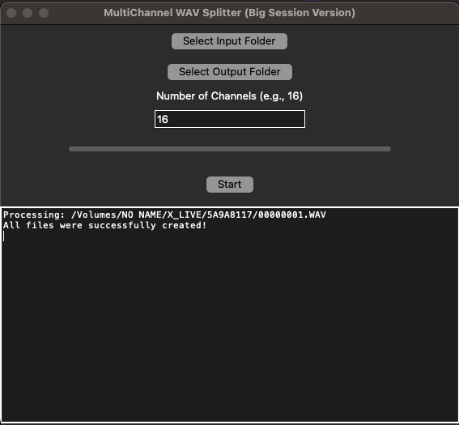

# X-Live Splitter

**X-Live Splitter** is an open-source tool for musicians and sound engineers.

➔ Splits X32/X-Live multichannel WAV recordings into individual mono WAV files.  
➔ Runs completely offline on macOS.  
➔ Full transparent source code – no spyware, no hidden processes.

---

## Features

- **Batch processing** of multi-GB multichannel WAV recordings
- **Flexible channel selection** (e.g., extract 16 out of 32 channels)
- **Automatic file merging** if recordings are split across multiple 4GB files
- **Simple graphical user interface (GUI)**
- **Open source, free to use, and completely offline**

---

## Screenshots

 

---

## How to Use

1. Make sure you have **Python 3.9+** installed (macOS usually comes with Python).
2. Install the required Python package:

```bash
pip install soundfile
```

3. Launch the application:

```bash
python3 split_wav_gui.py
```

4. Select your input and output folders, set the number of channels to extract, and start splitting!

---

## Icon

The application icon is included as `icon.png`.  
If you want to create a `.icns` file for macOS app bundling, follow the instructions provided below.

---

## License

This project is licensed under the **MIT License**.  
See the file `LICENSE` for more details.

---

## Contribution

Pull requests and issues are welcome!  
Let's improve the tool together.

---

## Downloads

Pre-built app bundles (for macOS) are available under [Releases](https://github.com/YOUR-GITHUB-USERNAME/X-Live-Splitter/releases).

---
